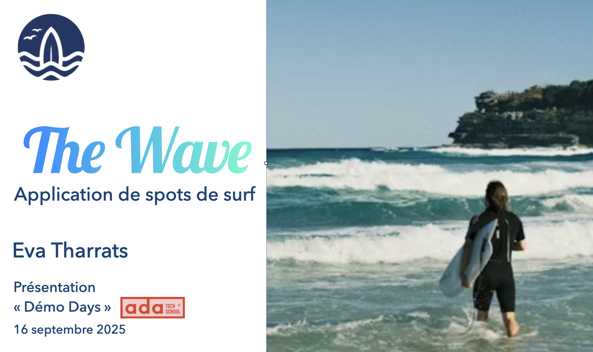

# 🌊 The Wave - application de spots de surf

Une plateforme communautaire connectant les surfeurs du monde entier autour de leur passion pour le surf.

<p align="center">

</p>

## 📋 Description

The Wave est une application web permettant aux passionnés de surf de découvrir et partager des spots de surf à travers le monde. La plateforme offre un espace de communauté où les surfeurs peuvent se connecter, explorer de nouveaux spots, liker et partager leurs expériences via des commentaires.

## ✨ Fonctionnalités

- 🗺️ Carte interactive des spots de surf dans le monde
- 👥 Système d'authentification sécurisé
- 🔐 Gestion des profils utilisateurs
- 👔 Panel d'administration pour les utilisateurs admin
- 🌍 Exploration des spots par localisation

## 🚀 Technologies utilisées

### Frontend

- **Next.js** - Framework React pour le rendu côté serveur
- **React** - Librairie JavaScript pour l'interface utilisateur
- **Tailwind CSS** - Framework CSS utility-first
- **React Leaflet** - Cartes interactives

### Backend

- **Express.js** - Framework Node.js pour l'API
- **Prisma** - ORM pour la gestion de la base de données
- **PostgreSQL** - Base de données relationnelle
- **Neon** - Hébergement de la base de données PostgreSQL

### Authentification & Sécurité

- **JWT** - Gestion des tokens d'authentification
- **bcrypt** - Hashage sécurisé des mots de passe

## 🛠️ Installation

### Prérequis

- Node.js (v18 ou supérieur)
- npm ou yarn
- PostgreSQL

### Backend

```bash
cd surf-back
npm install
```

Créez un fichier `.env` avec les variables suivantes :

```env
DATABASE_URL="votre_url_postgresql"
JWT_SECRET="votre_secret_jwt"
```

Lancez les migrations Prisma :

```bash
npx prisma migrate dev
```

Démarrez le serveur :

```bash
npm run dev
```

### Frontend

```bash
cd surf-front
npm install
```

Créez un fichier `.env.local` avec :

```env
NEXT_PUBLIC_API_URL="http://localhost:votre_port"
```

Démarrez l'application :

```bash
npm run dev
```

## 📦 Structure du projet

```
the-wave/
├── surf-back/          # API Express.js
│   ├── prisma/         # Schéma et migrations
│   └── src/            # Code source du backend
└── surf-front/         # Application Next.js
    ├── src/
    │   ├── app/        # Pages et routing Next.js
    │   └── components/ # Composants React
    └── public/         # Assets statiques
```

## 🔒 Authentification

Le système d'authentification permet :

- Inscription de nouveaux utilisateurs
- Connexion sécurisée avec JWT
- Vérification des mots de passe avec bcrypt
- Accès au panel admin pour les utilisateurs autorisés

## 🚧 Statut du projet

Ce projet est actuellement en développement. Les fonctionnalités principales implémentées incluent :

- ✅ Système d'authentification complet
- ✅ Affichage des spots de surf sur carte interactive
- ✅ Panel d'administration avec visualisation des membres
- 🚧 Fonctionnalités communautaires en cours de développement

## 👤 Auteur

Eva Tharrats

## 📄 Licence

Ce projet a été développé dans le cadre de ma formation à Ada Tech School - Septembre 2025.
